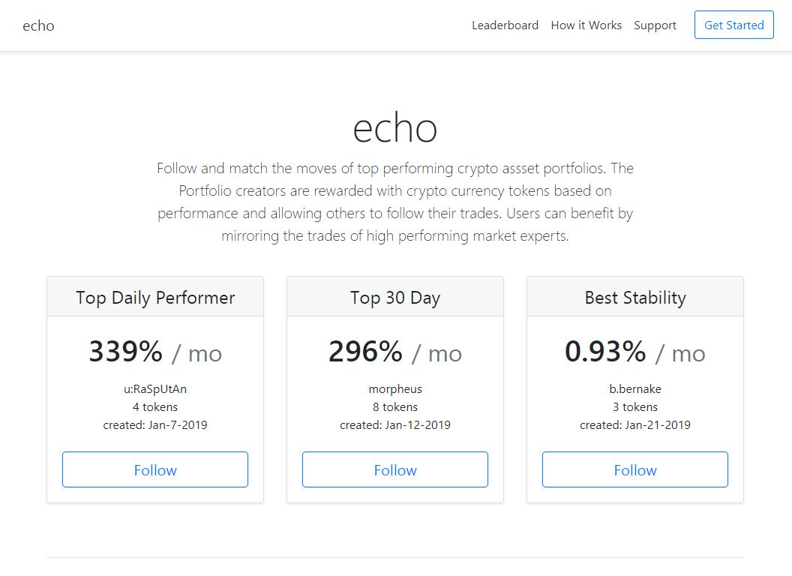
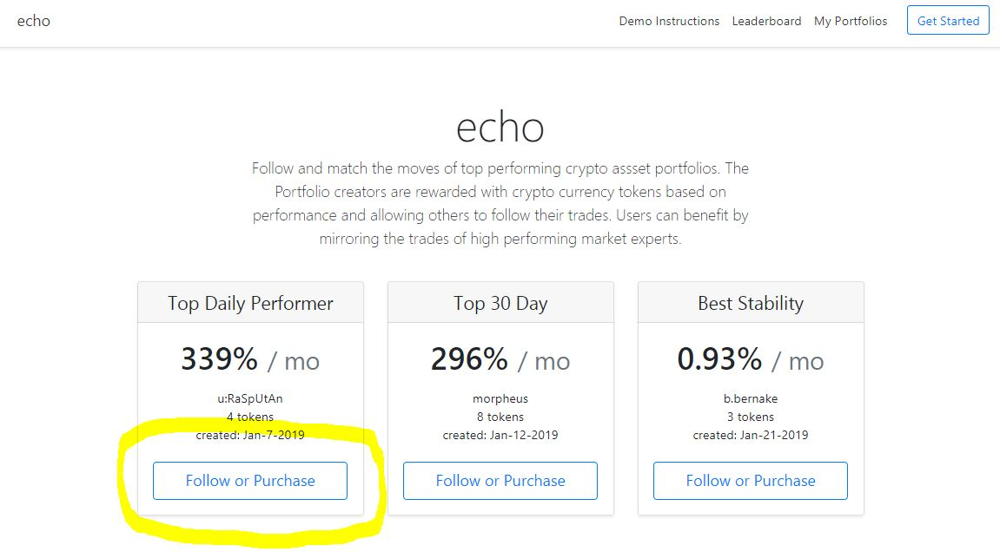
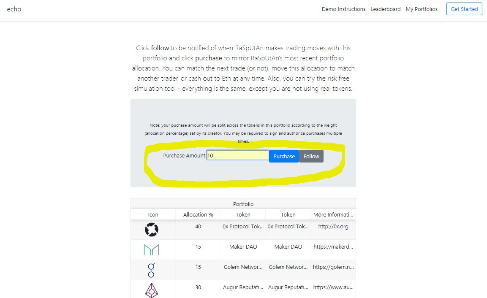
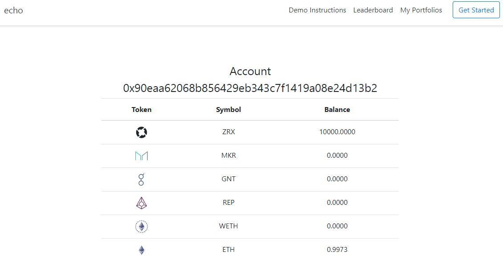

## echo, a 0x-hack
echo was a submission to the Feb 2019 [0x-hackathon](https://blog.0xproject.com/0x-coinlist-hackathon-3b48ddbfd21c). echo allows the user to follow and mirror trades of top performing portfolios (collections of tokens with weighted allocations).

  

## Demo - Setup

For the 0x-hack, the core scenario is working and can be walked through step by step below (the rest of the dApp is mocked up).

0x-hack Demo "echo" can be run from [heroku](https://powerful-plateau-28520.herokuapp.com/) (Febuary 2019)

* Ensure that you have an [Ethereum address](https://www.myetherwallet.com/)
* Suggest you use [Chrome browser](https://www.google.com/chrome/) with [Meta mask](https://metamask.io/) setup. 
* This demo has only been tested on [Kovan Testnet](https://kovan-testnet.github.io/website/). 
* You will need to have tokens unlocked for Ox, see the [code sandbox](https://codesandbox.io/s/github/0xproject/0x-codesandbox).
* You will need to have a token balance, there is a [faucet here](https://faucet.kovan.network/).

## Demo - Scenario

1. Go to the main page [heroku](https://powerful-plateau-28520.herokuapp.com/)

2. Click follow for the first card (name)

3. That takes you to the follow page and purchase page
4. Enter a purchase value, example 10

5. Click purchase, once complete you will be taken to you account/portfolio page.

## Demo - Troubleshooting
Make sure you have done all the steps in "Demo - Setup" and that you have a token balance on Kovan.

### Local - `npm start`
Runs the app in the development mode. 
Open [http://localhost:3000](http://localhost:3000) to view it in the browser.

The page will reload if you make edits. 
You will also see any lint errors in the console.

